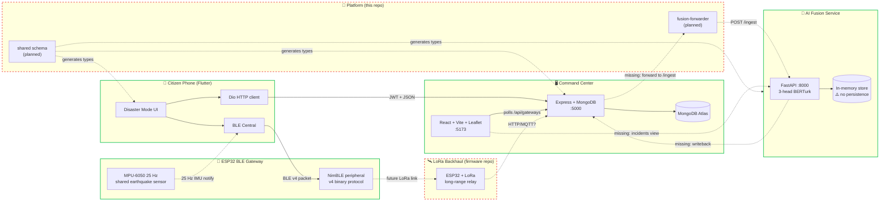

# Architecture

System overview of how the five Hayat Ağı components fit together. As of 2026-05-03 several edges are not yet wired — they're shown as dashed arrows below.

## Component diagram

**Legend:** solid arrows = wired today; dashed arrows = planned/missing.

## Data flow (target end-to-end)

1. **Earthquake hits.** Citizen opens the mobile app's Disaster Mode and sends "Enkaz altındayım" (trapped under rubble).
2. **BLE write to ESP32.** Mobile encodes a v4 binary packet (health profile + message + household JSON + XOR checksum) and writes to the gateway's RX characteristic.
3. **HTTPS to command-center** *(parallel path)*. Mobile also calls `POST /api/gateways/:id/disaster-events` with the same payload (when internet is available).
4. **Alert persisted.** Command-center backend writes an `Alert` document to MongoDB.
5. **Forwarded to AI.** *(missing)* The platform's `fusion-forwarder` reads new Alerts and calls `POST :8000/ingest` on the AI service with a transformed payload matching `IngestPayload`.
6. **Classification + clustering.** AI service runs the message through the 3-head BERTurk classifier, applies safety overrides, then clusters by 200 m / 60 min proximity into an `Incident`. Score and team dispatch computed.
7. **Writeback to MongoDB.** *(missing)* Forwarder writes `incident_id` and `ClassificationResult` back into the Alert document.
8. **Admin sees incident.** *(missing)* Frontend's `Incidents` page polls a backend proxy for the AI's `/incidents` and renders coloured markers on the Leaflet map by urgency + team.

## Integration readiness (2026-05-03)

| Edge | Status | Notes |
|---|---|---|
| Mobile ↔ ESP32 (BLE) | ✅ Wired | v4 binary protocol, 3 concurrent clients, persistent queue |
| Mobile ↔ Command-center | ✅ Wired | JWT, `/disaster-events` endpoint exists |
| Command-center ↔ AI | 📝 Sketched | Recipe in `ai/hayat-agi-fusion/COMMAND_CENTER_INTEGRATION.md`; code missing |
| AI → Command-center writeback | ❌ Not started | Fusion has no outbound HTTP client |
| Frontend → AI incidents | ❌ Not started | No proxy route, no React page |
| ESP32 → Cloud (LoRa) | ❌ Not started | Lives in separate firmware repo (TBD) |
| Phone-to-phone mesh | ❌ Not started | Mobile uses central mode only |

## Known constraints

- **AI fusion store is in-memory only.** Process restart wipes incidents. Needs sqlite or Postgres before production.
- **No auth on AI service.** `/ingest` accepts anonymous POSTs; CORS is `*`. Must be locked down before any non-localhost deploy.
- **iOS Info.plist is incomplete** — missing Bluetooth/location/mic permission strings; iOS build will crash on first prompt.
- **Backend has had a merge conflict** in `gatewayRoutes.js` (resolved on 2026-05-03 during fresh-init).
