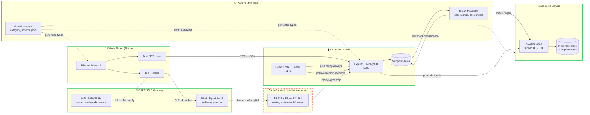

# Architecture

System overview of how the five Hayat Ağı components fit together. As of 2026-05-03 several edges are not yet wired — they're shown as dashed arrows below.

## Component diagram

**Legend:** solid arrows = wired today; dashed arrows = planned/missing.

## Data flow (end-to-end, working today)

1. **Earthquake hits.** Citizen opens the mobile app's Disaster Mode and sends "Enkaz altındayım" (trapped under rubble).
2. **BLE write to ESP32.** Mobile encodes a v4 binary packet (health profile + message + household JSON + XOR checksum) and writes to the gateway's RX characteristic.
3. **HTTPS to command-center.** Mobile also calls `POST /api/gateways/:id/disaster-events` with the same payload when internet is available.
4. **Alert persisted.** Command-center backend writes an `Alert` document to MongoDB with `classification.classified_at: null`.
5. **Forwarded to AI.** Platform's `fusion-forwarder` polls Mongo every 5 s, transforms the Alert into an `IngestPayload`, and calls `POST ai-fusion:8000/ingest`.
6. **Classification + clustering.** AI service runs the message through the 3-head BERTurk classifier, applies safety overrides, then clusters by 500 m / 60 min proximity into an `Incident`. Score, confirmation, and team dispatch are computed.
7. **Writeback to MongoDB.** Forwarder writes `incident_id` and the mapped classification subdoc back into the Alert.
8. **Admin sees incident.** Frontend `/dashboard/incidents` page polls `/api/admin/incidents` (proxied to AI's `/incidents`) every 5 s, renders gateway nodes + coverage circles + cluster mesh + urgency-coded incident markers on a Leaflet map; clicking a marker opens a detail panel with score breakdown, dispatched teams, source gateway, and the original message text fetched from `/api/admin/incidents/:id/messages`.

## Integration readiness (2026-05-03 — refreshed)

| Edge | Status | Notes |
|---|---|---|
| Mobile ↔ ESP32 (BLE) | ✅ Wired | v4 binary protocol, 3 concurrent clients, persistent queue |
| Mobile ↔ Command-center | ✅ Wired | JWT, `/disaster-events` endpoint, env-driven base URL |
| Command-center ↔ AI | ✅ Wired | `fusion-forwarder` Node service, Alert → IngestPayload + writeback both implemented |
| AI → Command-center writeback | ✅ Wired | Forwarder owns the writeback to Mongo |
| Frontend → AI incidents | ✅ Wired | `/api/admin/incidents` proxy + React Incidents page with map, clusters, detail panel |
| Original messages on detail | ✅ Wired | `/api/admin/incidents/:id/messages` joins event_ids → Alerts |
| Network coverage view | ✅ Wired | Mesh proximity + connected components + isolated-singleton highlighting |
| ESP32 → Cloud (LoRa relay) | 📝 Mesh code in [`mesh-core`](https://github.com/hayat-agi/mesh-core), but no cloud uplink yet (no WiFi/MQTT/HTTP in firmware) |
| Phone-to-phone mesh | ❌ Not started | Mobile uses BLE central mode only |
| AI service persistence | ❌ Not started | Still in-process dict; restart wipes incidents |
| AI service auth | ❌ Not started | `/ingest` is unauthenticated, CORS `*` |

## Known constraints

- **AI fusion store is in-memory only.** Process restart wipes incidents. Needs Postgres or Redis before production.
- **No auth on AI service.** `/ingest` accepts anonymous POSTs; CORS is `*`. Must be locked down before any non-localhost deploy.
- **iOS Info.plist is incomplete** — missing Bluetooth/location/mic permission strings; iOS build will crash on first prompt.
- **`mesh-core` firmware has no cloud uplink** — LoRa hop layer works but the message has to leave the mesh somehow. Open design question: WiFi gateway, MQTT to command-center, or BLE-to-phone hand-off.
- **Backend port 5001** locally because macOS AirPlay Receiver holds 5000 by default. Production deployment uses 5000 directly.
